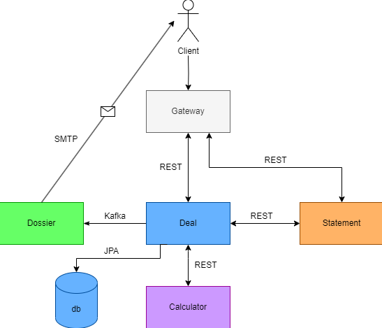
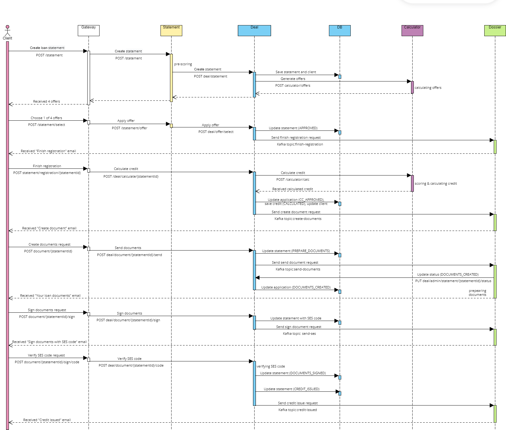
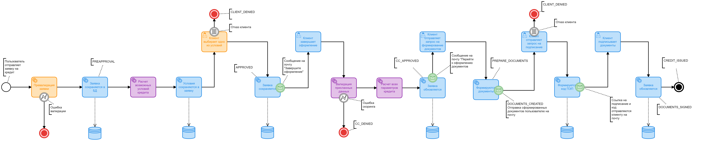

# Проектное задание: Java Development (весенний набор 2024)

## Общее

На данном проекте учащийся сможет реализовать бэкенд-приложение с микросервисной архитектурой - прототип небольшого банка.

Реализуя проект, учащийся приобретет знания и навыки, необходимые для любого современного бэкенд-разработчика:

- Разработка REST-API с использованием Spring Boot
- Работа с базой данных с использованием инструментов миграции
- Знание микросервисной архитектуры
- Синхронное и асинхронное взаимодействие сервисов через брокеры сообщений
- Документирование API через Swagger/OpenAPI
- Настройка CI-пайплайнов, контейнеризация приложения

## Цель проекта

Получить представление о Spring, PostgreSQL, Kafka и микросервисной архитектуре.

## Логика работы всей системы

1. Пользователь отправляет заявку на кредит.
2. МС Заявка осуществляет прескоринг заявки и, если прескоринг проходит, то заявка сохраняется в МС Сделка и отправляется в МС Калькулятор.
3. МС Калькулятор возвращает через МС Заявку пользователю 4 предложения (сущность "LoanOffer") по кредиту с разными условиями (например, без страховки, со страховкой, с зарплатным клиентом, со страховкой и зарплатным клиентом) или отказ.
4. Пользователь выбирает одно из предложений, отправляется запрос в МС Заявка, а оттуда в МС Сделка, где заявка на кредит и сам кредит сохраняются в базу.
5. МС Досье отправляет клиенту письмо с текстом "Ваша заявка предварительно одобрена, завершите оформление".
6. Клиент отправляет запрос в МС Сделка со всеми своими полными данными о работодателе и прописке. Происходит скоринг данных в МС Калькулятор, МС Калькулятор рассчитывает все данные по кредиту (ПСК, график платежей и т.д.), МС Сделка сохраняет обновленную заявку и сущность кредит, сделанную на основе CreditDto полученного из КК со статусом CALCULATED в БД.
7. После валидации МС Досье отправляет письмо на почту клиенту с одобрением или отказом. Если кредит одобрен, то в письме присутствует ссылка на запрос "Сформировать документы".
8. Клиент отправляет запрос на формирование документов в МС Досье, МС Досье отправляет клиенту на почту документы для подписания и ссылку на запрос на согласие с условиями.
9. Клиент может отказаться от условий или согласиться. Если согласился, МС Досье на почту отправляет код и ссылку на подписание документов, куда клиент должен отправить полученный код в МС Сделка.
10. Если полученный код совпадает с отправленным, МС Сделка выдает кредит (меняет статус сущности "Кредит" на ISSUED, а статус заявки на CREDIT_ISSUED).

## Архитектура и Business-flow






#### Цвета:

- **Оранжевый**: МС Заявка
- **Голубой**: МС Сделка + БД
- **Фиолетовый**: МС Калькулятор
- **Зеленый**: МС Досье
- **Красный**: Конец флоу

#### Типы действий:

- **Иконка "человек"**: Пользовательское действие
- **Иконка "зубчатое колесо"**: Действие системы
- **Иконка "молния"**: Ошибка
- **Иконка "прямоугольник с горизонтальными полосками"**: Выбор пользователя
- **Иконка "конверт"**: Асинхронная отправка email-сообщения на почту

<details>
<summary>Правила скоринга</summary>

### Прескоринг

Правила прескоринга (можно придумать новые правила или изменить существующие):

- Имя, Фамилия - от 2 до 30 латинских букв. Отчество, при наличии - от 2 до 30 латинских букв.
- Сумма кредита - действительное число, большее или равное 30000.
- Срок кредита - целое число, большее или равное 6.
- Дата рождения - число в формате гггг-мм-дд, не позднее 18 лет с текущего дня.
- Email адрес - строка, подходящая под паттерн `^[a-zA-Z0-9_!#$%&'*+/=?`{|}~^.-]+@[a-zA-Z0-9.-]+$`
- Серия паспорта - 4 цифры, номер паспорта - 6 цифр.

### Скоринг

Правила скоринга (можно придумать новые правила или изменить существующие):

- Рабочий статус: Безработный → отказ; Самозанятый → ставка увеличивается на 1; Владелец бизнеса → ставка увеличивается на 2.
- Позиция на работе: Менеджер среднего звена → ставка уменьшается на 2; Топ-менеджер → ставка уменьшается на 3.
- Сумма займа больше, чем 25 зарплат → отказ.
- Семейное положение: Замужем/женат → ставка уменьшается на 3; Разведен → ставка увеличивается на 1.
- Возраст менее 20 или более 65 лет → отказ.
- Пол: Женщина, возраст от 32 до 60 лет → ставка уменьшается на 3; Мужчина, возраст от 30 до 55 лет → ставка уменьшается на 3; Не бинарный → ставка увеличивается на 7.
- Стаж работы: Общий стаж менее 18 месяцев → отказ; Текущий стаж менее 3 месяцев → отказ.

</details>

<details>
<summary>API</summary>

### 9.1. calculator

- **POST**: `/calculator/offers` - расчёт возможных условий кредита.
- **POST**: `/calculator/calc` - валидация присланных данных + полный расчет параметров кредита.

### 9.2. deal

- **POST**: `/deal/statement` - расчёт возможных условий кредита.
- **POST**: `/deal/offer/select` - выбор одного из предложений.
- **POST**: `/deal/calculate/{statementId}` - полный расчет параметров кредита.
- **POST**: `/deal/document/{statementId}/send` - запрос на отправку документов.
- **POST**: `/deal/document/{statementId}/sign` - запрос на подписание документов.
- **POST**: `/deal/document/{statementId}/code` - подписание документов.
- **GET**: `/deal/admin/statement/{statementId}` - получить заявку по id.
- **PUT**: `/deal/admin/statement/{statementId}/status` - обновить статус заявки.

### 9.3. statement

- **POST**: `/statement` - первичная валидация заявки, создание заявки.
- **POST**: `/statement/offer` - выбор одного из предложений.

</details>

<details>
<summary>DTO сущности</summary>

- **LoanStatementRequestDto**
  ```json
  {
    "amount": "BigDecimal",
    "term": "Integer",
    "firstName": "String",
    "lastName": "String",
    "middleName": "String",
    "email": "String",
    "birthdate": "LocalDate",
    "passportSeries": "String",
    "passportNumber": "String"
  }
- **LoanOfferDto**
  ```json
  {
    "statementId": "UUID",
    "requestedAmount": "BigDecimal",
    "totalAmount": "BigDecimal",
    "term": "Integer",
    "monthlyPayment": "BigDecimal",
    "rate": "BigDecimal",
    "isInsuranceEnabled": "Boolean",
    "isSalaryClient": "Boolean"
  }

- **ScoringDataDto**
  ```json
  {
    "amount": "BigDecimal",
    "term": "Integer",
    "firstName": "String",
    "lastName": "String",
    "middleName": "String",  
    "gender": "Enum",
    "birthdate": "LocalDate",
    "passportSeries":   "String",
    "passportNumber": "String",
    "passportIssueDate": "LocalDate",
    "passportIssueBranch": "String",
    "maritalStatus": "Enum",
    "dependentAmount": "Integer",
    "employment": "EmploymentDto",
    "accountNumber": "String",
    "isInsuranceEnabled": "Boolean",
    "isSalaryClient": "Boolean"
  }
- **CreditDto**
  ```json
  {
    "amount": "BigDecimal",
    "term": "Integer",  
    "monthlyPayment": "BigDecimal",
    "rate": "BigDecimal",
    "psk": "BigDecimal",
    "isInsuranceEnabled": "Boolean",
    "isSalaryClient": "Boolean",
    "  paymentSchedule": "List<PaymentScheduleElementDto>"
  }
- **FinishRegistrationRequestDto**
  ```json
  {
  "gender": "Enum",
  "maritalStatus": "Enum",
  "dependentAmount": "Integer",
  "passportIssueDate": "LocalDate",
  "passportIssueBranch": "String",
  "employment": "EmploymentDto",
  "accountNumber": "String"
  }  
- **EmploymentDto**
  ```json
  {
    "employmentStatus": "Enum",
    "employerINN": "String",
    "salary": "BigDecimal",
    "posit  ion": "Enum",
    "workExperienceTotal": "Integer",  
    "workExperienceCurrent": "Integer"
  }
- **PaymentScheduleElementDto**
  ```json
  {
    "number": "Integer",
    "date": "LocalDate",
    "totalPayment": "BigDecimal",
    "interestPayment": "BigDecimal",
    "debtPaymen  t": "BigDecimal",
    "remainingDebt": "BigDecimal"
  }
- **StatementStatusHistoryDto**
  ```json
  {
    "status": "Enum",
    "time": "LocalDateTime",
    "changeType": "Enum"
  }
- **EmailMessage**
  ```json
  {    
    "address": "String",
    "theme": "Enum",
    "statementId": "Long"
  }
</details>

### Задание
Разработать приложение "Кредитный банк" с применением технологий и инструментов:
Java 17+, SpringBoot 2.7.Х, PostgreSQL, Spring Data JPA, Swagger, Kafka, JUnit, Lombok